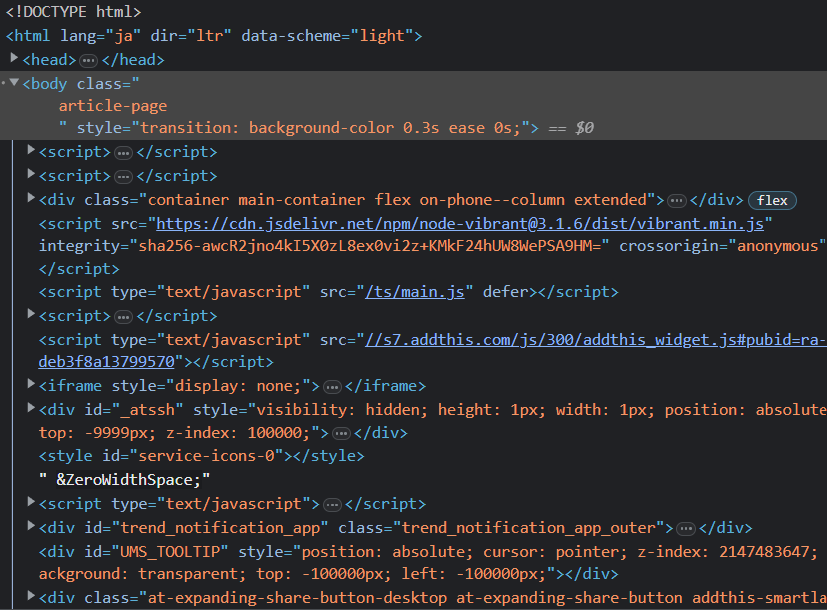

## プロローグ

世間一般よりもほんの少しだけPCスキルがある・・・そんな感じの中途半端なデジタルの素質を持ってる筆者なんですが，人生で何回かHPを作ってくれと頼まれたりしてきました．

今の時代

- Wixで誰でも作れるから人に頼まなくても良くね？
- Twitterやインスタで宣伝できるからHPなんか要らなくね？

と言われてもおかしくない時代なんですが，それでも「ホームページ」という物への需要はまだ完全に無くなってはいないみたいです．

今回の記事は，あまり技術関係に詳しくない方向けに書いたものです．

## ホームページを作る意味

一番大きなことは「情報の整理・集約化」だと思います．

例えば，あなたが飲食店の経営者で，毎日，TwitterやInstagramにお店のメニューを写真付きで投稿しているとします．拡散効果は期待できるでしょう．ですが，その情報は

「**時系列順に写真や文章が並んでいるだけ**」

であり，その情報の中にはお店からのお知らせや店主の独り言など，"他のカテゴリの情報" も含まれていますね．

「**シンプルにお店のメニューだけが見たい**」

と思ったお客さんが，過去の投稿を遡って色んなメニューの説明を見ていくのは非常に利便性(ユーザビリティ)が悪いです．

そんな時にホームページという，ググれば誰でも見つけられる場所（※）に料理の一覧を置いておくことで，**必要な人が必要な時に**情報を得ることができます．

>※ググれば誰でも見つけられる場所といいましたが，Google 検索で上位に表示されるにはある程度の閲覧数が必要です．

## ホームページの正体

「ホームページの正体」と言うと語弊があるので「Webページの正体」の方が適切かもしれません．

↓ざっくり言ってしまうとこれが「Webページの正体」です．





信じられないかもしれませんが，このダラダラと長いコードが「Webページ」です．極端な話，皆さんが普段見てるTwitter(アプリではなくブラウザ版)の正体もこれです．

ここで，恐らく皆さんの頭にこんな疑問が出てくると思います．

>Q. でもwixとかホームページ・ビルダーって見た目そのままに作れるよ？

簡潔に言います．コードに起こす作業をwixやホームページ・ビルダーが**あなたの代わりにやってます．**

勿論，今どきのWeb屋さんもケースバイケースですが，人の手で書くコードは最小限に減らすための色々な工夫をしています．あの長いコード全てを自分で書くことはごく稀でしょう．

## ホームページに関わる3つの要素

ホームページを作るうえで抑えておきたいのが，以下の3つの要素です．

1. ホームページの中身（を生成するためのツール）
2. サーバー（ホームページの置き場所）
3. ドメイン（置き場所の住所）

ドメインというのは，**www.google.co.jp** みたいなやつのことです．

### 中身・サーバー・ドメインが全てセット

1.と2.と3.が全てセットになったのが[「**wix**」](https://ja.wix.com/)や[「**Google サイト**」](https://sites.google.com/)みたいなものです．パワポ感覚でHPが作れます．業者に頼めないし簡易的なものでいいから作りたい，という用途には最適です．

ただもちろん無料なので制約は色々あります．一番大きいのが「ドメイン」の制約だと思います．wix使ったことがないので分かりませんが，ドメインは「〇〇.wix.com」みたいな形式になると思います．間違ってたらごめんなさい．

あと，wixの場合は画面内に「wixを使いませんか」みたいな広告が常駐するので，見栄えは悪くなりますね．

### 中身を作ってサーバー・ドメインは別に用意

恐らく2000年代まで個人で作るホームページの主流がこれ．[「**ホームページ・ビルダー**」](https://www.justsystems.com/jp/products/hpb/)などのソフトウェアを使って，見た目通りに作成します．その後，生成されたファイルをサーバーに手動でアップロード(コピー)します．

中身をパソコンの中で作ってから，サーバーに持っていくイメージです．

このサイトも，ホームページ・ビルダーとは全く別物ですが，「静的サイトジェネレーター」と呼ばれるツールを使って，PCの中でファイルを作ってから公開しています．

お金払ってサーバー契約すれば，広告も勝手に載りませんし，ドメインも自分で契約したものを自由に使えるので，これが一番ホームページらしいホームページが作れるかと思います．

### wixみたいなシステムをサーバーの中に設置してしまう(奥の手)

実は，先ほどの1+2+3の方法のように，ブラウザ上で更新してそのまま公開するシステムを，wixなどの大手サービスに頼らなくても，自分のサーバー内に設置することができます．

それが「**CMS**」と呼ばれるツールで，代表的なものが[**WordPress**](https://ja.wordpress.org/)です．

ただこれは環境構築が専門の知識がいることと，サーバーの中にデータベースを作成したりするため，システムが煩雑になりやすいという欠点があります．また，セキュリティ的なリスクもあり，万全な体制と人的余裕がなければ基本おすすめできません．

サーバー周りの管理をする専門の知識・技術を持った人がいて，それと別に内容を更新する人がいるのであれば，最適な方法だと思います．

## HP作りを友人・知人に委託したい人へ

私はちゃんとした仕事としてWeb屋をやっている訳ではないので，世の中のWeb屋さん達がどういう風に仕事をしているのかは分かりません．

ただ，個人的に今まで色々HPを作って来て思うのが，以下の点については，委託側と受託側で認識を共有して置いた方がいいような気がしました．

### 更新頻度

最初に基本的な情報(飲食店の例:アクセス，メニューなど)を書いたら後は放置する，あるいは最初の更新以降も定期的にお知らせなどを発信する，どれくらいのペースで更新していきたいのかは，予めイメージしておいた方がいいと思います．

### どこまでを自分でやるか

本当に何も分からないと言う場合は，載せたい内容をWordファイルにまとめたり簡単なメモにして送ったり，という感じで良いと思いますし，逆に自分でも直接手を加えたい場合は，相手にもその旨伝えておいた方が良いかと思います．

### どこまで相手に介入させるか

ホームページの中身だけを作って欲しいか，サーバー内のファイルの操作も許可するか，そこら辺のルールもしっかりと決めておいた方がいいかもしれません．

### 引き継ぎ

これが一番難しいかなと思いました．先述の通り，我々も全てのコードを手打ちしている訳ではなく「ツール」に頼っているのですが，そのツールもホームページ・ビルダーのような初心者向けではなく，そこそこのスキルが求められる上級者向けのツールだったりします．

例えば，このサイトは「Hugo」というツールを使って作ったのですが，この更新を後任者に引き継ぐのであれば，Hugoが使える人を引っ張ってくるか，最低限使い方をレクチャーするかしないといけない訳です．

もっと面倒くさいのが「WordPress」のようなCMSで，例えばシステムがぶっ壊れた時の応急措置やら，データベース周りのパスワードやら，引き継がないといけない内容が多いこと，

さらに，プラグインを使って機能を拡張していくのでシステムが煩雑になって・・・面倒くさいです．正直言ってあまり手を出したくないのです(使っている最中は楽だけど)

## まとめ

という訳で，今回の記事を通して伝えたかったことは

 - HPを作る目的を今一度確認して欲しい
 - 中身＋サーバー＋ドメインの組み合わせを理解して欲しい
 - 誰かに頼むなら色々なルール決めや認識共有をして欲しい

ということでした．最後までご覧いただきありがとうございました．