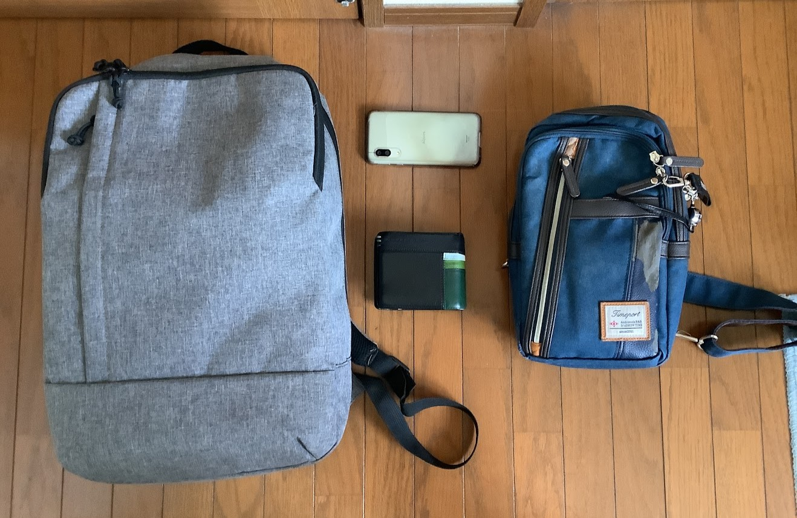

カバー写真: [ぱくたそ](https://www.pakutaso.com/)

>**～おことわり～**  
>この記事の筆者は，幼少期から広汎性発達障害（のグレーゾーン）の傾向が見られたものの，その当時は医師による正式な診断は受けていませんでした．ただし，執筆時点では心療内科より正式にADHDの診断をもらっています．また，この手の話題は個人による症状差が大きいため，あくまで私個人のケースとして捉えてもらえると幸いです．

## 普段の荷物

皆さんがいつも外出する時，絶対に必要なものって何でしょうか．少なくとも以下の3つは，どんな場合でも常に携帯してないといけないと思います．

 - 家の鍵（＋車の鍵）
 - 財布
 - 携帯電話

私は基本，ズボンの左前ポケットに財布，右前ポケットに携帯電話を入れてます．ただ，鍵などを入れる場所がないので，それらを持ち運ぶためだけに**ショルダーポーチ**を携帯します．定期券や交通系ICカードも，ショルダーポーチにくっつけてます．

加えて，私は学生ですので教科書などを**バックパック**で持ち歩きます．

さらに，悪天候時には傘が必要です．

ここまでの荷物の構成は以下のようになります．ついでに，写真も撮っておきました（床が汚くてごめんなさい）．

 - 財布（左ポケット）
 - 携帯電話（右ポケット）
 - ショルダーポーチ
 - バックパック

さて，ここから実体験の話をしていきます．

## 困りごと1: ショルダーポーチとバックパックの紐が絡まる

ショルダーポーチとバックパックを体から降ろすときに，身に着けた順番と逆順で外していかなくてはいけませんが，順番を間違えて紐が絡まってオロオロしてしまうときが多々あります．特に，バスや電車などの公共交通に乗って席に着いた際に，荷物をどかしたいなと思って人前でこれをやらかすのが，本当に恥ずかしい．

## 困りごと2: 傘を持ち歩いているとき

傘を持ち歩いているときは最悪です．片手が塞がっているので，例えば土足禁止の空間（傘立てがない場所）に入ったとき，靴の履き替えで時間がかかります．というか，手先が不器用なのでただでさえ時間がかかるのに・・・

後ろに人がいると，自分で詰まってしまって，ただただ申し訳なく切ない気持ちになります．

## 外出時以外でも

夕飯の支度とか，食器の片づけとか，普段のちょっとした動作の中で，今手に持っているものをどこにどかせば良いのか，次に何を手に持てば良いのか，うまく脳内で計算できません．普通の人ならすぐ終わる作業が，2～3倍くらいの時間がかかってしまいます．

## まとめ

とにかく日頃の生活において，カバン類や手に持っている荷物を瞬間的に捌くのが，本当に苦手です．全体的な動作が，周囲から見てもちょっと「子供っぽい」「もたもたしている」「変な人っぽい」って感じになって，「この人変だよね」って思われて距離を置かれる（もしくは自分でそう見られてると思い込んで距離を置いてしまう）ことがあります．

もっと要領良く生きていきたいですね・・・