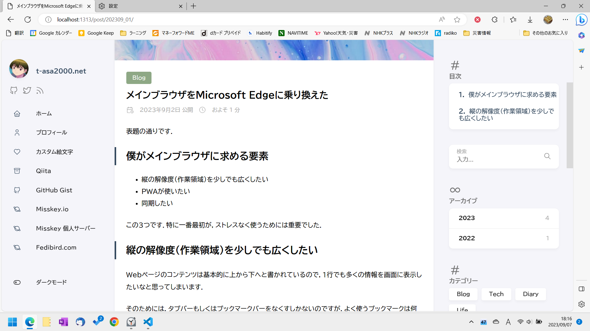
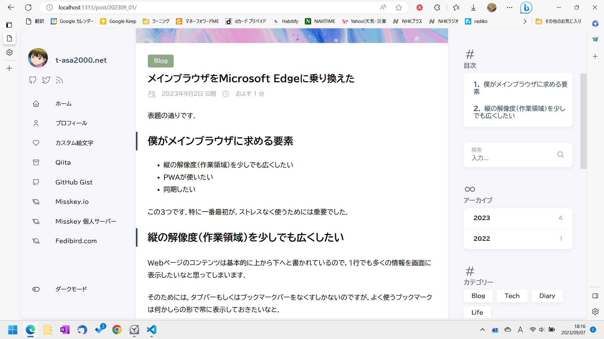

表題の通りです．

## 僕がメインブラウザに求める要素

- 縦の解像度（作業領域）を少しでも広くしたい
- PWAが使いたい
- 同期したい

この3つです．特に一番最初が，ストレスなく使うためには重要でした．

## 縦の解像度（作業領域）を少しでも広くしたい

Webページのコンテンツは基本的に上から下へと書かれているので，1行でも多くの情報を画面に表示したいなと思ってしまいます．

そのためには，タブバーもしくはブックマークバーをなくすしかないのですが，よく使うブックマークは何かしらの形で常に表示しておきたいなと．

最近になってChromeが「サイドバーでブックマーク等を表示する」機能に対応したのですが，既に対応していたFirefoxやEdgeと比べると，後追いのせいかどうしても使い勝手が良くないなと思います．行間が広すぎて表示できる量が少ないし，表示/非表示も(Firefoxより)ワンテンポ遅い気がします．

そうすると選択肢がEdgeかFirefoxに限られてくるのですが，Firefoxは「PWAに対応してない」「NHKプラスが使えない」とか色々問題が出てきたので，最終的にメインブラウザをChrome→Edgeに乗り換えることにしました．

## 垂直タブ機能が良い

垂直タブ機能があるかないかの違いを比較してみましょう．（写真はこの記事の執筆中の画面です）

サイトのCSS(レイアウト)の都合上，正確な比較ができてないのはご容赦を．(垂直タブをONにしたことで，記事の横幅が狭くなり，サムネイル画像が小さくなったことで本文の位置が上がっています．)

画像では分かりにくいかもしれませんが，この数十ピクセル程度の違いがとても大事なんです．私は普段15インチ(16:9,FHD)のノートPCを使っているのですが，タブバーがある分視線が下に行くので，その分若干首も下を向くので，首コリが酷いわけです．いやいやこんなん誤差の範囲でしょ・・・って思われるかもしれませんが，少しコンテンツの位置が上がるだけで，結構変わると思います．

> **2023.9.8 追記**  
> すみません．ただ単に「垂直タブ」をONにするだけでは，画像のようになりません．「設定＞外観＞ツールバーのカスタマイズ」で「垂直タブでタイトルバーを非表示にする」をONにする必要がありました．
>
> **2023.10.2 追記2**  
> 今現在は「垂直タブ」を無効化して使っています．結局タブ操作する度に，タブバーをホバーして展開させないといけないのがめんどくさくなってきたので．．．首コリのくだりは今読み返したら「何言ってんだコイツ」って思ったので，全部忘れてください(笑)

あと私はそこまでタブを開く方ではない（多い時でも12～3個程度）ので，タブバーの右側の余白が無駄ですごく勿体ないなと思ってたんです．なので，タブバーを横から縦にするという発想はすごく良いなと前々から思ってました．（タブを閉じたいときに，一度ホバーしないといけないから手間だけど・・・）

------

以上がブラウザを乗り換えた経緯になります．ただ，以前からChromeとEdgeは併用していて，今回はブックマークなどを入れ替えて，メインとサブを交代させた感じです．今でもChromeは学業用のサブブラウザとして愛用しています．

## 余談

実は現在，Edge（メイン），Chrome（学業用），Firefox（プライベート用のサブ）の3つを併用しています．Firefoxまで活用してるのは，広告ブロックを使いたい時用や作った物のFirefoxでの動作確認用で残してるのもありますが，全部が全部Chromiumに喰われるのも面白くないので，応援の意味も込めて使ってます．