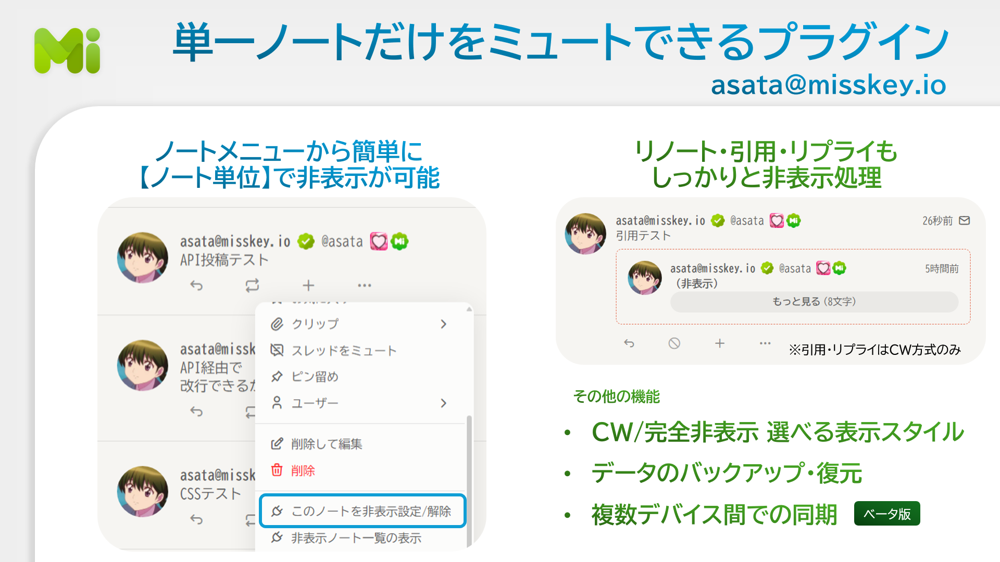
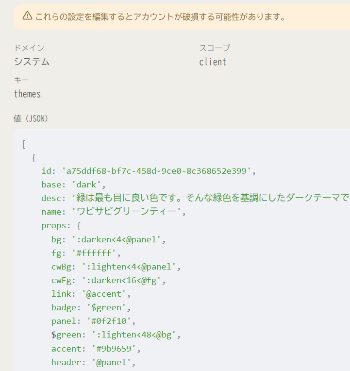
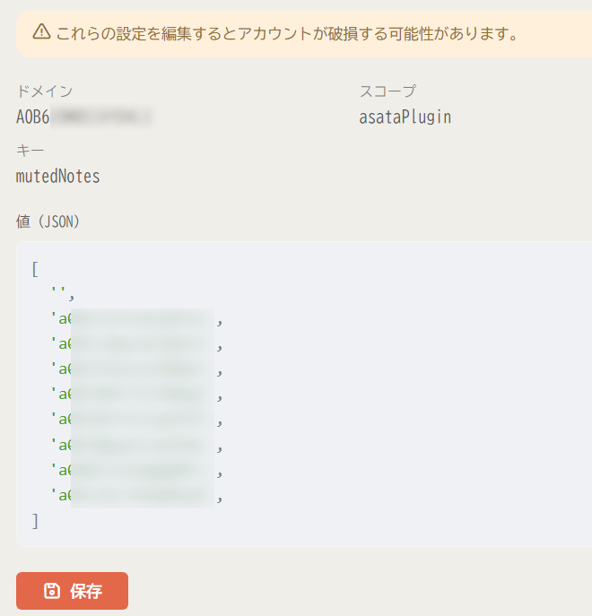

>この記事は [**「Misskey Advent Calendar 2024」 8日目**](https://adventar.org/calendars/10208) の記事です．

こんにちは．主に[Misskey.io](https://misskey.io/)で活動している[asata](https://misskey.io/@asata)と申します．

今回は [Misskey](https://github.com/misskey-dev/misskey) のプラグインを自作していく中で気が付いた **「レジストリAPI」** に関する知見をまとめていけたらなと思っています．

## 自作したプラグイン

私が今回作成したのは **「ノート非表示プラグイン」** というもので，これは個別のノート単位で疑似的なミュートができるというものになります．

タイムライン上に不快に思うような内容が流れてきて，**「その人自体は嫌いじゃないけどこのノートだけはもう目に入れたくない」** みたいな場面を想定して作りました．（単純に自分がそういう時にあったらいいな・・・と思ってたので）

https://misskey.io/@asata/pages/notemuteplugin





## プラグインのデータをサーバー上で同期させたかった

Misskeyでは，クライアントに関する情報は基本的にクライアントに保存されます．

なので，どういうプラグインを入れたとか，そのプラグインの設定やデータはサーバー上に保存されません．

同じプラグインをスマホとPCで使いたければ，それぞれのデバイスにインストールすることになります．しかし，両方のデバイスで**常に同じ状態をキープするということはできない**わけです．

ただ私は，できることなら実際のミュート機能の使い勝手に近づけたいと **「ミュート設定したノートIDのリストをデバイス間で同期したい」** と考えていました．そんな中，タイムラインで教えて頂いたのが **「レジストリAPI」** です．

## レジストリって何？

Misskeyにおける「レジストリ」とは，**「キー」と「値」の組み合わせ** で自由な値をサーバー上に保存しておける機能です．値の型は，文字列・数値・配列・オブジェクト，どれでもOKみたいです．

Misskey自体も，各種設定を保存するためにレジストリを使用しています．





レジストリは階層構造となっており，「ドメイン」⇒「スコープ」⇒「キー」という形となっています．「スコープ」は client/aaa のように多重構造（入れ子）にすることも可能です．

## レジストリを使えば設定が同期できる・・・はずだった

これを踏まえて，私は **「同じドメイン・スコープ・キーでレジストリを読み書きすれば，ミュート設定したノートを同期できる」** と考え実装に入りました．

Misskey プラグインは，[**AiScript**](https://github.com/aiscript-dev/aiscript) というJavaScriptベースの言語で記述します．また，Misskey内でAiScriptを使用する場合は [**「AiScript Misskey 拡張API」**](https://misskey-hub.net/ja/docs/for-developers/plugin/plugin-api-reference/)と呼ばれる専用のAPIが使用できます．今回はこちらを使ってプラグインからMisskeyのAPIを叩きます．

↓こんな感じでMisskeyのレジストリAPIを叩きます．

```js
// 非表示ノートの設定(サーバー)
@setMutedNotesServer(notes) {
  Mk:api('i/registry/set', {
    key: 'mutedNotes',
    scope: ['asataPlugin'],
    value: notes,
    domain: 'asata'
  })
}
```

さて，ここで問題が生じました．上記のコード内ではドメインを **「asata」** としていますが，実際のレジストリでは **全く関係のない文字列をドメインとして** 読み書き操作が行われていたのです．





しかも，この文字列，プラグインをインストールし直すごとに変わってしまいます．つまりこれは **「異なるデバイス間で同じレジストリのキーを参照できない」＝「同期ができない」** ということになります．

## 外部からレジストリAPIを叩くとドメインは無視される

Misskeyのバックエンドのソースコードを見てみると，その原因が分かりました．

[packages/backend/src/server/api/endpoints/i/registry/set.ts](https://github.com/misskey-dev/misskey/blob/dac3b1f40591cb697cf650bff7e4cb99cc964f89/packages/backend/src/server/api/endpoints/i/registry/set.ts) より引用

```ts
@Injectable()
export default class extends Endpoint<typeof meta, typeof paramDef> { // eslint-disable-line import/no-default-export
  constructor(
    private registryApiService: RegistryApiService,
  ) {
    super(meta, paramDef, async (ps, me, accessToken) => {
      await this.registryApiService.set(me.id, accessToken ? accessToken.id : (ps.domain ?? null), ps.scope, ps.key, ps.value);
    });
  }
}
```

スマホ等では少し見辛いかもしれませんが，レジストリAPI用の関数に投げる第2引数が `accessToken ? accessToken.id : (ps.domain ?? null)` となっています．

どうやら外部からレジストリAPIを叩く場合は **「指定したドメイン名を無視してアクセストークンのIDをドメインにする」** という仕様のようです．ドメイン名となっていた謎の文字列は，インストール時にプラグイン用に生成されたアクセストークンのIDだったみたいですね．

## レジストリを使った同期をするための方法

ただ，プラグインのデータをレジストリ経由で同期できないという訳ではありません．各デバイスにインストールされたプラグインが **同じアクセストークンを使用すれば** 同期を行うことができます． 

残念ながら，プラグインの実装ではこの問題をどうにかすることは不可能なので， **プラグインを使うユーザーに対して** 以下の操作を促すことになります．

2つの **デバイス「A」と「B」** でMisskeyをしていると仮定して説明します．

1. **デバイスA** でプラグインをインストールする．
2. 「設定のバックアップ」機能で，インストール直後のクライアントの状態をバックアップする．
3. **デバイスB** 上で「設定のバックアップ」機能から **デバイスA** で作成したバックアップをクライアントに適用する．

これにより，2つのデバイス上で同じプラグインがインストールされます．しかも，**デバイスA** のインストール時に生成したアクセストークンが **紐づいた** 状態でインストールされます．

これでようやく **レジストリを使った同期** ができるようになります．

## 最後に

以上， Misskey プラグインに（無理矢理ですが）同期機能を実装してみたという記事でした．

ドメイン名を強制的に書き換えるという仕様は，セキュリティ的にやむを得ないんじゃないかなと思っています．

- 悪意のあるプログラムがドメインを偽装してレジストリ書き換える
- たまたまサードパーティー同士でドメインが重複してしまう

みたいなケースも十分考えられますからね．

最後までお読みいただき，ありがとうございました．