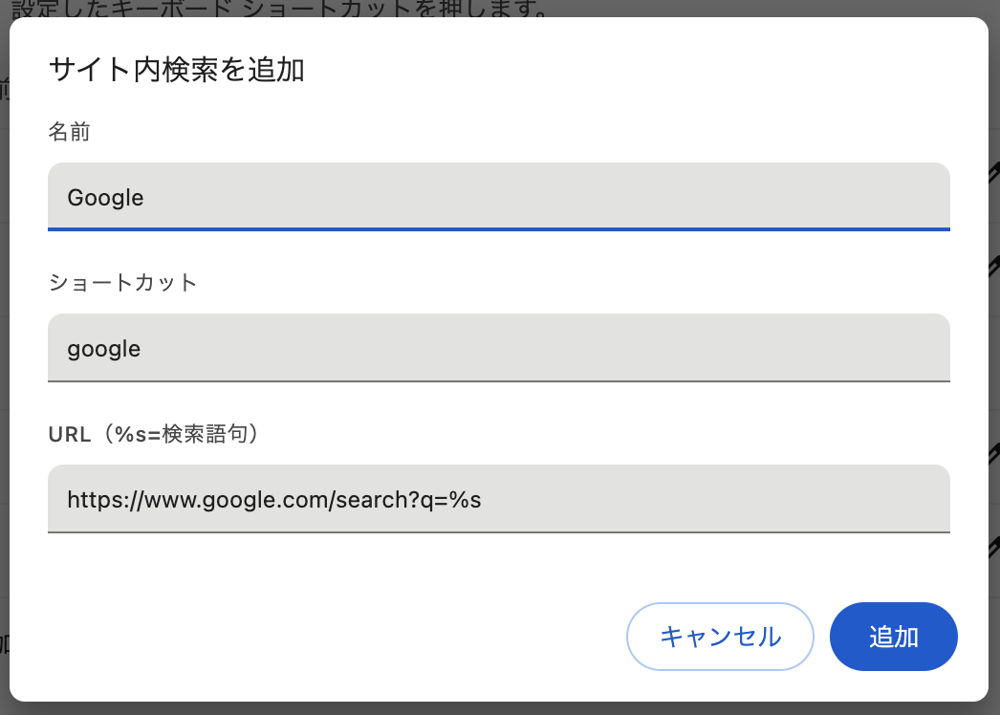

今回のブログはかなり **「思想強め」** です．

-------

>11月20日、アメリカの司法省は、グーグルの検索サービスの独占を解消するためとして、インターネット閲覧ソフト（ブラウザ）「Chrome（クローム）」事業の売却を含む是正案を裁判所に提出した。立教大学ビジネススクールの田中道昭教授は「アメリカには、公正な自由競争に対する信念が強く根付いており、資本の独占に対して厳しく臨んできた歴史がある。今回の訴訟により、グーグルは戦略の転換を迫られている」という――。

手軽に｢ググる｣はもうできなくなる?…米司法省がグーグルに｢Chrome売却｣を要求した本当の理由 | PRESIDENT Online  
https://president.jp/articles/-/89180

-------

要はGoogleが大きくなりすぎたから，**分割してそれぞれの分野で競争促しましょうね** っていう話ですね．



私の感想ですがハッキリ言って <b style="font-size:1.5em">今更遅すぎるし無駄</b> だと思ってます．



私はあくまで寡占そのものに賛成というのではなく，**「一度寡占させてしまったものは諦めろ」** 派です．

もし一社による寡占が問題だと思うなら，ここまで大きくなる前に **早期に芽を摘んでおく** 必要があったんです．消費者がすでにそのサービスを使用するのが定着してしまったものを破壊するのは，それが果たして本当に多くの人々にとって良いことなのか疑問に思います．

確かに競争を促して市場が健全化されるのは良いことだと思います．しかし，最終消費者（エンドユーザー）に利益か還元されなければ意味がないですよね．

力の弱い生産者のためだけに，大多数の消費者の利便性を犠牲にするならば，それこそ **「公的機関に泣きつくことで得をする弱者ビジネス」** じゃないですか．

-------

と感情的に批判しても何も始まらないので，米司法省の提案1個1個について自分なりの意見を書いていこうと思います．

## Chromeブラウザの売却

> **1. Chromeブラウザの売却**
>
>（目的）  
>・グーグルが検索市場での支配力を維持するためにChromeを利用しているため、その売却によって競争を促進。
>
>（具体的措置）  
>・グーグルはChromeを第三者に売却する義務を負う。  
>・売却後、グーグルは5年間ブラウザ市場に再参入することを禁止される。  

**「競争を促進」** なんて無理だと思います．分離したところで多くのユーザーは「Google」っていう検索エンジンを知ってしまったのですから，自分らでChromeをインストールして検索エンジンをGoogleに設定することでしょう．

**「知名度」** というものは恐ろしい物です．だってそれを知ってしまったら，他の検索エンジンを知る必要がないのですから．(Googleに不満がない限り)

結果が出ないと分かっていても，他のプラットフォーマーが感じる不公平を放置することが，公的機関として問題だから形だけでも対処しておいた方が良いのはわかります．立場上やらなくてはいけないのでしょう．

これによって，例えばGoogle アカウントによる同期ができなくなるなど，**消費者の利便性を阻害していること**に関してはどうでもいいのでしょうか．まあ実際売却してもどこまで技術協力を許可するかにもよりますし，もしかしたら**Chrome アカウント**なる独自の同期アカウントが誕生するかもしれません．

## Androidに関する規制

> **2. Androidに関する規制**
>
>（選択肢1）Androidの分割  
>・グーグルがAndroidを使用して検索市場の競争を妨害する行為を防止。  
>・Androidを完全に分離・売却する。  
>
>（選択肢2）行動上の是正措置  
>・グーグルがAndroidを利用して自社の検索エンジンを優遇する行為を制限。  
>・プラットフォーム上での公平性を確保するための監視と規制の導入。  

Androidの場合は，Googleとエンドユーザーの間にベンダーが挟まりますので，ベンダーが自由に検索エンジンを選べるようにするというのは良いことだと思います．

あとAndroidに**Google Playストアをプリインストールして端末を売るためには，他のGoogle アプリも抱き合わせにしないといけない**のも規制したら効果的だと思います．というかむしろこっちの方が寡占としては問題なんじゃないんでしょうか．

## デフォルト検索エンジン契約の禁止

> **3. デフォルト検索エンジン契約の禁止**
>
>・グーグルが他社デバイスやブラウザで検索エンジンをデフォルトに設定するために金銭的価値を提供する契約を禁止。

これ自体は良いことだと思うんですけど，それによってFirefoxが死滅しそうになってることについてはなんとも思わないんでしょうか．

Firefoxを開発するMozillaがGoogleの独禁法訴訟でGoogleの各種事業が破壊されると運営資金がピンチになると訴える  
https://gigazine.net/news/20241219-mozilla-google-browsers/

（Safariは自社OSでしか使えないからほっておいて）ブラウザの寡占状態になったら，それこそ独立したChromeが暴走して，ブラウザ界のGoogleになる危険性も十分にあります．

拡張機能への締め付けとか，(オープンソースとはいえ) 自社が有利になるようなChromiumへの改変を平気でやるようになると思う．

## データ共有と透明性の向上

> **4. データ共有と透明性の向上**
>
>（データの提供）  
>・グーグルが収集した検索データや広告データをライバル企業に共有。  
>・共有は無償で、プライバシーを保護したうえで行われる。  
>
>（広告データの透明性）  
>・広告主に対し、検索広告のパフォーマンスやコストに関する詳細情報を提供。  
>・広告データをライバルプラットフォームで利用可能にする仕組みを導入。  

これ例えば何かしらのパラダイムシフトで，Bingがシェア1位になったらMicrosoftにも同じことを要求するんでしょうか．

そうじゃなきゃ不公平ですよね．もしGoogle一社にこれを許して前例ができてしまったら，どのプラットフォーマーもビジネスに少し慎重になってしまう気がします．

むしろそれぞれのプラットフォーマーがデータ収集・活用技術を向上させガンガン稼がせた方が，競争促進にもなるし何より**アメリカの経済的な国益**になると思います．

## 競争を促進する仕組み

> **5. 競争を促進する仕組み**
>
>・グーグルの検索結果データ（インデックスやランキングシグナル）をライバルが利用できる形で提供。  
>・10年間、グーグルの検索結果や広告の一部をサードパーティが利用可能にする。  

これ最初にも書きましたが，**米司法省が早期に規制をして肥大化を抑止していれば**こんなことやる必要なかったんですよ．

「お前ら大きくなりすぎたから，一時的にボランティアになれ」って言ってるようなもんですよね．

競争促進には効果的だと思いますが，米司法省はこのような時間調整をしないといけない状況を作ったことを **「恥ずかしいこと」** だと認識した方が良いと思います．

## 競争の妨害行為を防止するための管理

> **6．競争の妨害行為を防止するための管理**  
>（技術委員会の設置）  
>・グーグルの是正措置の履行を監視するために独立した技術委員会を設置。  
>・コンプライアンスオフィサーの任命：グーグル内部に、是正措置の遵守を保証する責任者を設置。  
>
>（違反の防止）  
>・グーグルが裁判所の是正措置を回避したり、競争を妨害する行為をしたりした場合の罰則を規定。  

ごくごく普通の競争健全化施策なので飛ばします．

## ユーザー選択を増やすための取り組み

> **7. ユーザー選択を増やすための取り組み**
>
>・グーグルブラウザやAndroidデバイスでの「検索エンジン選択画面（choice screen）」の導入。  
>・選択画面を通じて、ユーザーが公平に他の検索エンジンを選択できる仕組みを確立。  

そもそもその選択画面ですら，Googleが認知しているサービスだけが一覧に載るんでしょ．一部のプラットフォーマーを優遇してることに変わりないじゃないですか．(EUのInternet Explorerへの規制でも同じこと思ってた)

**1.** でも言いましたけど，Google の知名度とシェアが広がってしまった以上大半のユーザーが「Google」を選ぶことに変わりありません．やらないよりはマシってことなんでしょうけど．

ユーザーにとって公平に検索エンジンを選択できるようにするならば，デフォルトで**検索エンジンを一切搭載せずに，** 以下のようにユーザーに一から手動設定させるべきです．





え？ **「デジタル慣れしてない一般ユーザーに負担が大きすぎる」** だって？

甘えたこと言わないでください．~~**「公平」** が大事なんでしょ．これくらいやれよ．~~

------

若干，というかほぼ屁理屈みたいなことしか言ってませんが，要は **「大きくなりすぎてからの規制は消費者に負担と混乱を招くだけ」** ということを言いたかっただけです．